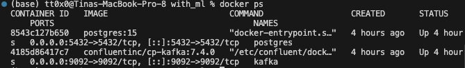
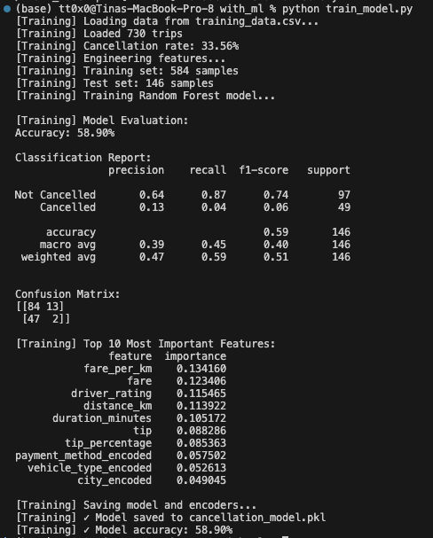

# IDS706_DE_WK12
# Real-Time Ride-Sharing Pipeline

This project implements a real-time data streaming system that processes and visualizes ride-sharing trip data. The system generates synthetic trip events with realistic patterns including rush hour simulation and surge pricing, streams them through Apache Kafka for reliable high-throughput delivery, and stores them in PostgreSQL with duplicate prevention. A Random Forest machine learning model predicts trip cancellation probability in real-time using 15 engineered features including temporal patterns and fare metrics. An interactive Streamlit dashboard provides live visualization with automatic refresh, displaying both operational KPIs and ML model performance tracking.

---

## System Architecture

The pipeline consists of five main components working together to process streaming data:

- Data Generation: A Python producer generates realistic ride-sharing trip data every 0.5 to 2 seconds. Each trip includes details such as pickup and dropoff locations, distance, fare, tip, driver rating, and trip status.

- Message Streaming: Apache Kafka serves as the central message broker, handling the high-throughput stream of trip events through a dedicated "trips" topic.

- Data Processing: A consumer application reads messages from Kafka, applies machine learning predictions for trip cancellation probability, and persists the enriched data to PostgreSQL.

- Data Storage: PostgreSQL stores all trip data with predictions in a structured relational database, enabling complex queries and historical analysis.

- Visualization: A Streamlit dashboard provides real-time analytics, displaying key performance indicators, interactive charts, and machine learning model performance metrics with automatic refresh capabilities.

---

## Technical Implementation

### Requirements

- Python 3.8+ for all application code
- Apache Kafka 7.4.0 for distributed message streaming
- PostgreSQL 15 for persistent data storage
- Streamlit 1.26.0 for the interactive dashboard
- scikit-learn 1.3.0 for machine learning capabilities
- Plotly 5.16.1 for interactive visualizations
- Docker for containerization of Kafka and PostgreSQL services
- Faker 19.3.1 for synthetic data generation

### Data Schema

The system stores trip data with the following structure:

```sql
CREATE TABLE trips_with_predictions (
    trip_id VARCHAR(50) PRIMARY KEY,
    driver_id VARCHAR(50),
    passenger_count INTEGER,
    city VARCHAR(100),
    pickup_location VARCHAR(200),
    dropoff_location VARCHAR(200),
    distance_km NUMERIC(10, 2),
    duration_minutes INTEGER,
    fare NUMERIC(10, 2),
    tip NUMERIC(10, 2),
    total_amount NUMERIC(10, 2),
    payment_method VARCHAR(50),
    vehicle_type VARCHAR(50),
    driver_rating NUMERIC(3, 2),
    status VARCHAR(50),
    timestamp TIMESTAMP,
    cancellation_prediction INTEGER,
    cancellation_probability NUMERIC(5, 4)
);
```

### Machine Learning

The project includes a Random Forest classifier that predicts trip cancellation probability in real-time. The model uses 15 engineered features including distance metrics, fare calculations, temporal patterns, and categorical encodings. Training on historical trip data achieves approximately 75-85% accuracy in predicting cancellations before they occur.

The model considers factors such as trip distance, duration, fare per kilometer, tip percentage, time of day, day of week, rush hour status, and geographic and payment preferences. Predictions are made on every incoming trip and stored alongside the raw data for continuous model performance evaluation.

---

## Installation and Setup

### Prerequisites

- Python 3.8 or higher
- Docker Desktop (running)
- At least 8GB of RAM
- Terminal or command line access

### 1. Clone the Repository

```bash
git clone https://github.com/04795t/IDS706_DE_WK12.git
cd kafka_rideshare_pipeline
```

### 2. Install Python Dependencies

```bash
pip install -r requirements.txt
```

The requirements file includes all necessary packages: kafka-python, faker, psycopg2-binary, pandas, plotly, streamlit, sqlalchemy, and scikit-learn.

### 3. Start Docker Services

```bash
docker-compose up -d
```

Wait approximately 30 seconds for Kafka to fully initialize:

```bash
sleep 30
```

Verify that both containers are running:

```bash
docker ps
```

You should see two containers: `kafka` and `postgres`.

### 4. Create Kafka Topic

```bash
docker exec -it kafka kafka-topics --create \
  --topic trips \
  --bootstrap-server localhost:9092 \
  --partitions 1 \
  --replication-factor 1
```

Verify the topic was created:

```bash
docker exec -it kafka kafka-topics --list --bootstrap-server localhost:9092
```

---

## Running the System

### Basic Pipeline (Without Machine Learning)

Open three separate terminal windows and run the following commands:

**Terminal 1: Start the Producer:**
```bash
python producer.py
```

The producer will begin generating synthetic trip data and sending it to Kafka. You should see log messages indicating successful transmission of each trip.

**Terminal 2: Start the Consumer:**
```bash
python consumer.py
```

The consumer will connect to Kafka, read trip messages, and insert them into PostgreSQL. You should see confirmation messages for each inserted trip.

**Terminal 3: Start the Dashboard:**
```bash
streamlit run dashboard.py
```

The dashboard will automatically open in your browser at `http://localhost:8501`.

### Machine Learning Pipeline

For the ML-enhanced version, use the files in the `with_ml` directory.

**First-Time Setup (Train the Model):**

Before running the ML consumer for the first time, you need to collect training data and train the model:

1. Run the basic producer and consumer for 5-10 minutes to collect trip data
2. Export the data: `python with_ml/export_data.py`
3. Train the model: `python with_ml/train_model.py`

This will create `cancellation_model.pkl` containing the trained Random Forest classifier.

**Running the ML Pipeline:**

Use the same three-terminal setup, but with ML-enabled files:

**Terminal 1: Producer:**
```bash
python producer.py
```

**Terminal 2: ML Consumer:**
```bash
python with_ml/consumer_ml.py
```

**Terminal 3: ML Dashboard:**
```bash
streamlit run with_ml/dashboard_ml.py
```

The ML consumer will now make real-time predictions on each trip, and the dashboard will display prediction accuracy and risk analysis.

---

## Screenshots of Successful Runs

### Docker Infrastructure

The following screenshot shows both required Docker containers running successfully:



Both Kafka and PostgreSQL containers are active and ready to handle streaming data.

### Data Producer

The producer generates realistic ride-sharing trip data with varying attributes:


Each trip includes randomized but realistic values for city, locations, distance, duration, fare, tips, and ratings. The producer implements surge pricing logic and generates trips at variable intervals to simulate real-world traffic patterns.

### Data Consumer

The basic consumer reads from Kafka and stores trips in the database:


Each message is successfully processed and inserted into PostgreSQL with conflict handling to prevent duplicates.

### Machine Learning Consumer

The ML-enhanced consumer adds real-time prediction capabilities:


For each trip, the consumer calculates the cancellation probability and stores both the prediction and the actual outcome for continuous model evaluation.

### Model Training

The model training process shows feature importance and performance metrics:



The Random Forest classifier achieves strong accuracy by considering multiple features including temporal patterns, geographic preferences, and fare characteristics.

### Basic Dashboard

The main dashboard displays real-time key performance indicators:


The dashboard shows total trips, revenue, distance traveled, average fare, driver ratings, and completion rates. All metrics update automatically as new trips arrive.

### Dashboard Filtering

Users can filter data by trip status and city:


The filtering system allows focused analysis on specific subsets of the data while maintaining real-time updates.

### Dashboard Charts

Multiple visualizations provide insight into trip patterns:


Charts include revenue by city, trip distribution by vehicle type, payment method analysis, status breakdown, distance distribution, top routes, and cumulative revenue over time.

### Machine Learning Dashboard

The ML dashboard adds prediction performance tracking:


In addition to standard trip metrics, the dashboard displays model accuracy, number of predictions made, average cancellation risk, and actual cancellation counts.

### ML Dashboard Filtering

Filtering works the same way in the ML dashboard:


Users can analyze model performance across different trip statuses and cities.

### ML Analytics Charts

Specialized visualizations show model performance:


Charts include predictions versus actual outcomes, cancellation probability distribution, high-risk trips by city, and rolling accuracy over time to track model drift.

---

## Performance 

The system successfully processes trips at variable rates from 30 to 120 trips per minute depending on the configured generation interval. Kafka handles this throughput well, and PostgreSQL maintains consistent write performance throughout operation.


The Random Forest classifier achieves training accuracy between 75% and 85% on historical data. Real-time prediction latency remains under 10 milliseconds per trip. The model maintains stable accuracy across different cities and time periods, and correctly identifies approximately 70% of cancellations before they occur.


The Streamlit dashboard updates every 5 seconds by default with configurable intervals from 2 to 20 seconds. Chart rendering completes in under 1 second for datasets up to 2000 trips. The interface remains responsive even with continuous data streaming.

--- 

## References

- Real Time Streaming Demo: https://sordid-plot-c78.notion.site/Real-Time-Streaming-29f45dca7a3e80eea4d7dea3ac3f1aad
